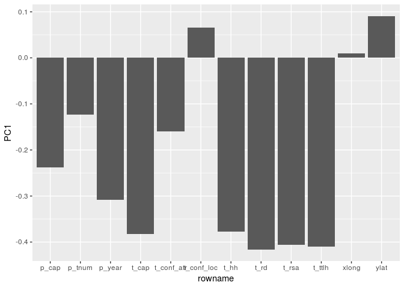
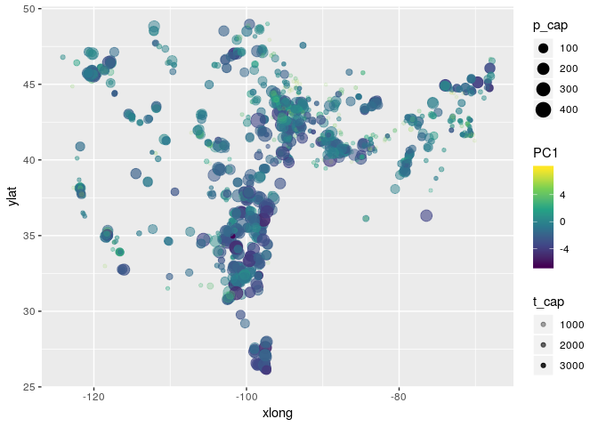
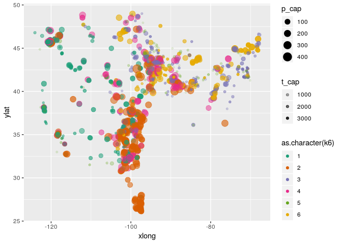
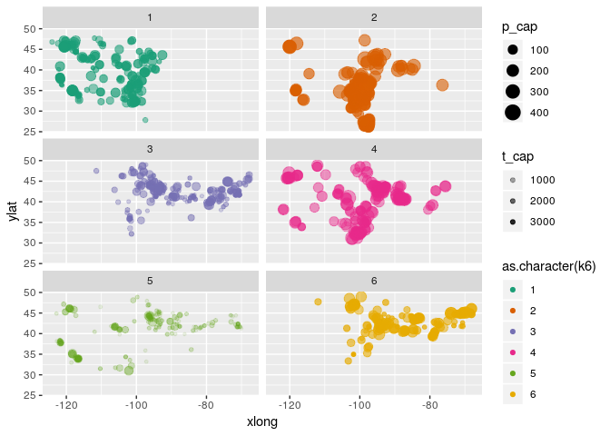
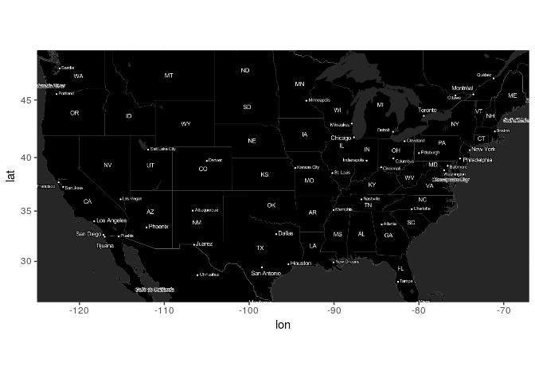
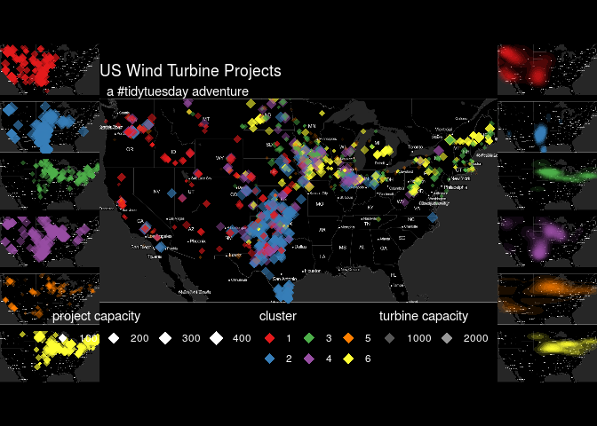

2018-11-06
================
Tanner Koomar

-   [Load Data](#load-data)
-   [Reduce Dimensionality](#reduce-dimensionality)
    -   [Do a PCA](#do-a-pca)
    -   [Some plots](#some-plots)
    -   [Cluster](#cluster)
    -   [Cluster Plots](#cluster-plots)
-   [Make a pretty map under the data](#make-a-pretty-map-under-the-data)
-   [Plots](#plots)
    -   [Squish together](#squish-together)

#### Load Data

Reduce Dimensionality
---------------------

### Do a PCA

Looks like PC1 makes up the bul of the difference, and it is due to turbine rotor sweep area

``` r
dat.pca <- prcomp(dat.p.num, center = TRUE, scale. = TRUE)

summary(dat.pca)
```

    ## Importance of components:
    ##                           PC1    PC2     PC3     PC4     PC5     PC6
    ## Standard deviation     2.3420 1.3762 1.00832 0.98379 0.94979 0.86079
    ## Proportion of Variance 0.4571 0.1578 0.08473 0.08065 0.07517 0.06175
    ## Cumulative Proportion  0.4571 0.6149 0.69963 0.78028 0.85546 0.91720
    ##                           PC7     PC8     PC9    PC10    PC11    PC12
    ## Standard deviation     0.7040 0.53133 0.35791 0.27616 0.10600 0.01020
    ## Proportion of Variance 0.0413 0.02353 0.01067 0.00636 0.00094 0.00001
    ## Cumulative Proportion  0.9585 0.98202 0.99270 0.99905 0.99999 1.00000

``` r
dat.pca$rotation %>% as.data.frame() %>% rownames_to_column() %>%
  ggplot(aes(y = PC1, x = rowname)) + 
  geom_col()
```



### Some plots

``` r
dat.p.num %>% 
  bind_cols(as.tibble(dat.pca$x)) %>%
  ggplot(aes(x = xlong, ylat, color = PC1, size = p_cap, alpha = t_cap)) +
  scale_color_viridis_c() + 
  geom_point()
```



### Cluster

``` r
## Use the PCs that explain 95% of the variance
dat.k <- dat.pca$x %>% as.tibble %>%
  select(1:7) %>%
  mutate(
    k2 = kmeans(., 2)$cluster, 
    k3 = kmeans(., 3)$cluster,
    k4 = kmeans(., 4)$cluster,
    k5 = kmeans(., 5)$cluster,
    k6 = kmeans(., 6)$cluster
  ) %>% bind_cols(dat.p.num)
```

### Cluster Plots

``` r
dat.k %>% 
  ggplot(aes(x = xlong, ylat, color = as.character(k6), size = p_cap, alpha = t_cap)) +
  scale_color_brewer(palette = "Dark2") + 
  geom_point()
```



``` r
dat.k %>% 
  ggplot(aes(x = xlong, ylat, color = as.character(k6), size = p_cap, alpha = t_cap)) +
  scale_color_brewer(palette = "Dark2")+ 
  geom_point() + 
  facet_wrap(~ as.character(k6), nrow = 3)
```



Make a pretty map under the data
--------------------------------

``` r
library(ggmap)
invert <- function(M) {
  i <- function(x){rgb(t(255-col2rgb(x))/255)}
  
  m <- M %>% apply(2, i) %>% as.raster()
  
  class(m) <- class(M)
  attr(m, "bb") <- attr(M, "bb")
  return(m)
  }

us <- c(left = -125, bottom = 25.75, right = -67, top = 49)
m <- get_stamenmap(us, zoom = 5, maptype = "toner-lite") 
ggmap(invert(m))
```



Plots
-----

``` r
plot.points <- ggmap(invert(m), extent = 'device') + 
  geom_point(aes(x = xlong, y = ylat, color = as.character(k6), size = p_cap, alpha = t_cap), data = dat.k, pch = 18) + 
  scale_color_brewer(palette = "Set1") + 
  facet_wrap(~k6, ncol = 1) + 
  theme_void() + 
  theme(legend.position = 'none', strip.text = element_blank()) + 
  theme(plot.background = element_rect(fill = "black", color = "black"), 
        panel.background = element_rect(fill = NULL))

plot.density <- ggmap(invert(m), extent = 'device') + 
  stat_density2d(aes(x = xlong, y = ylat, alpha = ..level.., fill = as.character(k6), color = NULL), data = dat.k, geom = "polygon") + 
  scale_fill_brewer(palette = "Set1") + 
  facet_wrap(~k6, ncol = 1) + 
  theme_void() + 
  theme(legend.position = 'none', strip.text = element_blank()) + 
  theme(plot.background = element_rect(fill = "black", color = "black"), 
        panel.background = element_rect(fill = NULL))

plot.all <- ggmap(invert(m), extent = 'device') + 
  geom_point(aes(x = xlong, y = ylat, color = as.character(k6), size = p_cap, alpha = t_cap), data = dat.k, pch = 18) + 
  scale_color_brewer(palette = "Set1") + 
  guides(
    size = guide_legend(title = "project capacity",title.position = 'top', override.aes = list(color = "white")),
    alpha = guide_legend(title = "turbine capacity",title.position = 'top', override.aes = list(color = "white", size  = 4)), 
    color = guide_legend(title = 'cluster', title.position = 'top', override.aes = list(size = 4))
  ) + 
  ggtitle("US Wind Turbine Projects", "  a #tidytuesday adventure") +
  theme_void() + 
  theme(title = element_text(color = 'white'),
        legend.position = 'bottom', 
        legend.background = element_blank(),
        legend.text = element_text(color = "white"),
        legend.title = element_text(color = "white"),
        legend.key = element_blank(),
        axis.text = element_blank(),
        axis.title = element_blank(),
        plot.background = element_rect(fill = "black", color = "black"), 
        panel.background = element_rect(fill = NULL))
```

### Squish together

``` r
library(cowplot)
```

    ## 
    ## Attaching package: 'cowplot'

    ## The following object is masked from 'package:ggmap':
    ## 
    ##     theme_nothing

    ## The following object is masked from 'package:ggplot2':
    ## 
    ##     ggsave

``` r
final.plot <- plot_grid(plotlist = list(plot.points, plot.all, plot.density), nrow = 1, rel_widths = c(.25,1,.25))
ggdraw(final.plot) + 
  theme(plot.background = element_rect(fill = "black", color = 
"black"))
```



``` r
png("2018-11-05_final_plot.png", width = 1500, height = 750, res = 175)
ggdraw(final.plot) + 
  theme(plot.background = element_rect(fill = "black", color = 
"black"))
dev.off()
```

    ## png 
    ##   2
