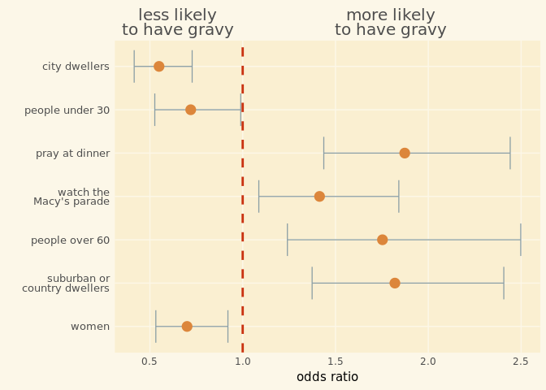
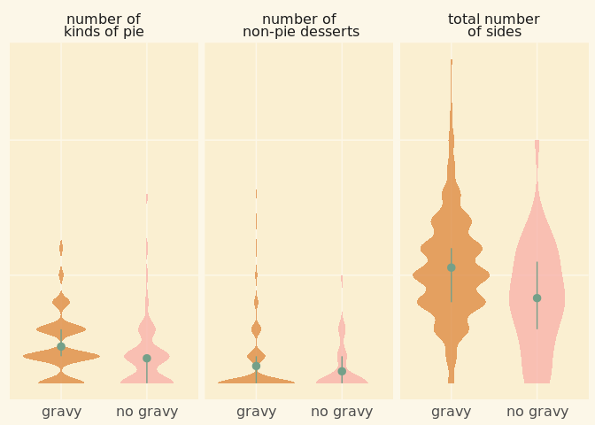
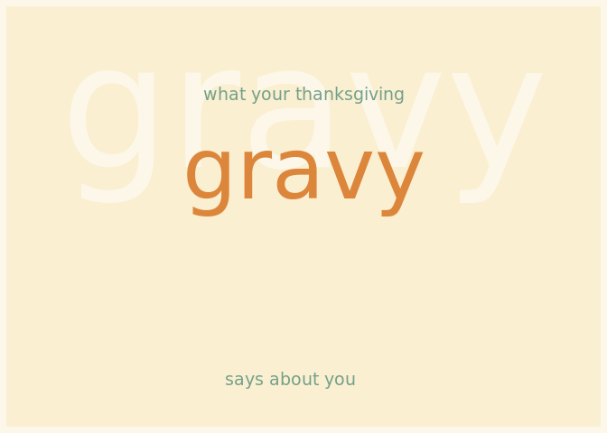
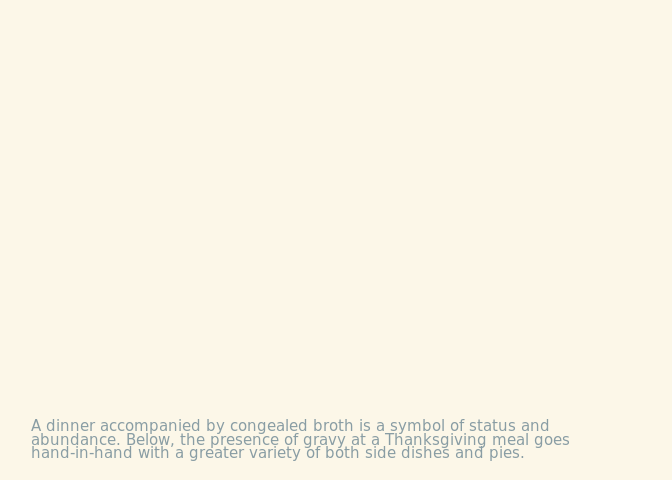
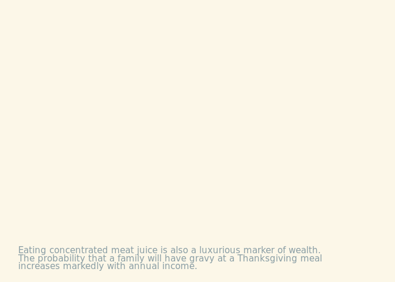
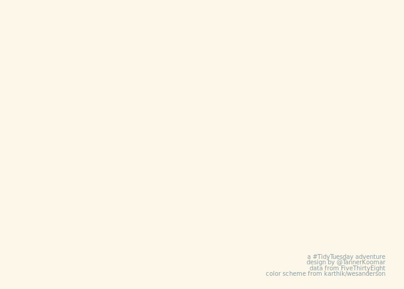
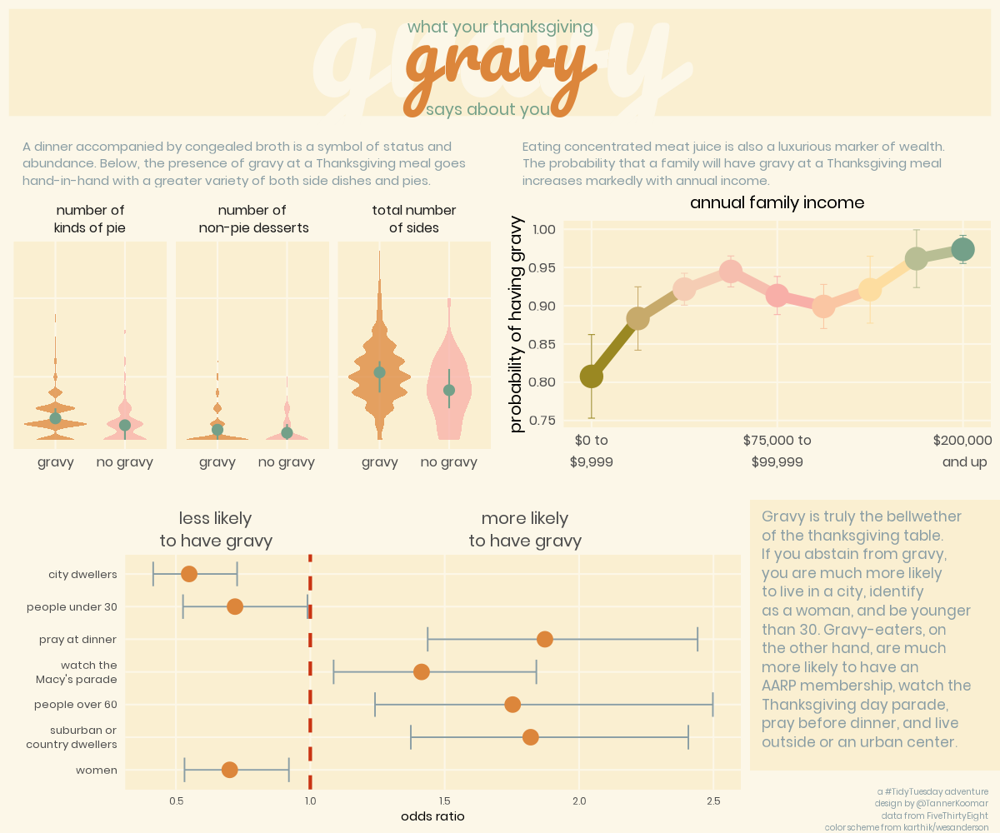

2018-11-20
================
Tanner Koomar
November 19, 2018

-   [Odds Ratio](#odds-ratio)
-   [Violin Plots](#violin-plots)
-   [Line Chart of Income](#line-chart-of-income)
-   [Text Boxes](#text-boxes)
-   [Plots Assemble!](#plots-assemble)
-   [The final Plot](#the-final-plot)

Boy is this data messy! Lets relabel and organize it a bit.

``` r
dat <- dat %>% 
  filter(is.na(dat) %>% rowSums() < 50) %>% 
  select(-id, -pie13, -dessert11, -side15, -contains("Other")) %>% 
  mutate(
    "number of\nkinds of pie" = select(., contains("pie")) %>% {!is.na(.)} %>% rowSums(),
    "total number\nof sides" = select(., contains("side")) %>% {!is.na(.)} %>% rowSums(), 
    "number of\n non-pie desserts" = select(., contains("dessert")) %>% {!is.na(.)} %>% rowSums()
    ) %>% mutate(
      family_income = factor(family_income,
                             levels = c("$0 to $9,999" , "$10,000 to $24,999", "$25,000 to $49,999", "$50,000 to $74,999", "$75,000 to $99,999", "$100,000 to $124,999", "$150,000 to $174,999", "$175,000 to $199,999", "$200,000 and up", "Prefer not to answer", "NA"),
                             ordered = T)
)
```

Odds Ratio
----------

``` r
plot_or <- dat %>% 
  transmute(
    urban = community_type == "Urban",
    not_urban = community_type != "Urban",
    parade = !is.na(watch_program), 
    under30 = dat$age == "18 - 29",
    over60 = dat$age == "60+",
    female = dat$gender == "Female",
    pray = dat$prayer == "Yes"
    ) %>%
  #select(prayer, female, friendsgiving, urban, not_urban, parade, under30, over60) %>%
map(function(x){
    out <- table(gravy = dat$gravy, foo = x) %>%  fisher.test(conf.level = 0.6827) 
    out <- c(out$estimate, lower = out$conf.int[1], upper = out$conf.int[2])
    return(out)
  }) %>%
  as.data.frame() %>%
  rownames_to_column() %>%
  gather(key, value, -rowname) %>%
  spread(rowname, value) %>%
  ggplot(aes(y = key, x = `odds ratio`))+ 
  geom_errorbarh(aes(xmin = lower, xmax = upper), size = .45, color = "#899DA4", height = 0.75) + 
  geom_point(size = 4, color = "#DC863B") + 
  geom_vline(xintercept = 1, lty = 2, lwd = 1, color = "#C93312") + 
  scale_x_continuous(
    sec.axis = sec_axis(~ ., breaks = c(0.65, 1.8), labels = c("less likely\nto have gravy", "more likely\nto have gravy"))
    ) + 
  scale_y_discrete(labels = c("pray" = "pray at dinner",
                              "urban" = "city dwellers",
                              "not_urban" = "suburban or\ncountry dwellers",
                              "female" = "women",
                              "under30" = "people under 30",
                              "over60" = "people over 60",
                              "parade" = "watch the\nMacy's parade")
  ) + 
  ylab("") + 
  xlab("odds ratio") + 
  theme_minimal() + 
  theme(
    text = element_text(family = "Poppins"),
    axis.text.x.top = element_text(size = 15, lineheight = 0.75), 
    axis.text.y = element_text(size = 10, lineheight = 0.7), 
    axis.ticks.x.top = element_blank(),
    plot.background = element_rect(color = NA, fill = "#fcf7e8"),
    panel.background = element_rect(color = NA, "#faefd1"), 
    panel.grid = element_line(color = "#fcf7e8"),
    panel.grid.minor = element_blank()
  )

plot_or
```



Violin Plots
------------

``` r
plot_totals <- dat %>% 
  filter(!is.na(gravy)) %>% 
  select(contains("number"), gravy) %>%
  gather(key, value, -gravy) %>%
  mutate(gravy = case_when(
    gravy == "Yes" ~ "gravy",
    gravy == "No" ~ "no gravy"
  )) %>%
  ggplot(aes(x = gravy, y = value, fill = gravy)) + 
  scale_fill_manual(values = c("gravy" = "#DC863B", "no gravy" = "#F8AFA8")) + 
  geom_violin(alpha = 0.75, color = NA) +
  stat_summary(fun.y = mean, 
               fun.ymin = function(x){ quantile(x, probs = 0.25) }, 
               fun.ymax = function(x){ quantile(x, probs = 0.75) }, 
               color = "#74A089", 
               size = 0.5
                 ) + 
  facet_wrap(~ key) + 
  theme_minimal() + 
  theme(legend.position = 'none',
    text = element_text(family = "Poppins"),
    strip.text = element_text(size = 12, lineheight = 0.75),
    axis.text.x.top = element_text(size = 15), 
    axis.text.x = element_text(size = 12), 
    axis.title.x = element_blank(),
    axis.ticks.x.top = element_blank(),
    axis.text.y = element_blank(),
    axis.title.y = element_blank(),
    plot.background = element_rect(color = NA, fill = "#fcf7e8"),
    panel.background = element_rect(color = NA, "#faefd1"), 
    panel.grid = element_line(color = "#fcf7e8"),
    panel.grid.minor = element_blank()
    )

plot_totals
```



Line Chart of Income
--------------------

``` r
plot_income <- dat %>% 
  filter(family_income != "NA" & family_income != "Prefer not to answer") %>%
  group_by(family_income) %>%
  summarize(
    gravy = mean(gravy == "Yes", na.rm = T),
    gravy_sd = sqrt(gravy*(1-gravy)/n())
    ) %>%
  ungroup() %>%
  ggplot(aes(y = gravy, x = family_income, group = 1, color = family_income)) + 
  geom_line(size = 3) + 
  geom_point(size = 6) + 
  geom_errorbar(aes(ymin = gravy - gravy_sd, ymax = gravy + gravy_sd), size = .25, width = .15) + 
  scale_color_manual(values = wesanderson::wes_palette("Royal2", n = 9, type = "c") ) + 
  scale_x_discrete(breaks = c("$0 to $9,999" ,"$75,000 to $99,999",   "$200,000 and up"), labels = c("$0 to\n$9,999" ,"$75,000 to\n$99,999",   "$200,000\n and up")) + 
  ggtitle("annual family income") + 
  ylab("probability of having gravy") + 
  theme_minimal() + 
  theme(
    legend.position = 'none',
    text = element_text(family = "Poppins"),
    axis.text.x = element_text(size = 12), 
    axis.title.x = element_blank(),
    axis.ticks.x.top = element_blank(),
    axis.text.y = element_text(size = 12),
    axis.title.y = element_text(size = 15),
    plot.background = element_rect(color = NA, fill = "#fcf7e8"),
    panel.background = element_rect(color = NA, fill = "#faefd1"), 
    panel.grid = element_line(color = "#fcf7e8"),
    panel.grid.minor = element_blank(),
    plot.title = element_text(size = 15, hjust = 0.5)
  ) 

plot_income
```


Text Boxes
----------

``` r
header <- ggplot() + 
     annotate(geom = "text", y = 3.15, x = 2, size = 50, family = "Pacifico", color = "#fcf7e8",
          label="gravy") + 
 annotate(geom = "text", y = 3.25, x = 2, size = 5, family = "Poppins", color = "#74A089",
          label = "what your thanksgiving" ) + 
 annotate(geom = "text", y = 2.5, x= 2, size = 25, family = "Pacifico", color = "#DC863B",
          label="gravy") + 
annotate(geom = "text", y = .35, x = 2, size = 5,family = "Poppins", color = "#74A089", hjust = .6,
         label = "says about you") + 
  ylim(0,4) + 
  theme_void() + 
  theme(
    plot.background = element_rect(color = "#fcf7e8", fill = "#faefd1", size = 5)
  )

header
```



``` r
midbar1 <- ggplot() + 
  ylim(-2,2) + 
  xlim(-2,2) + 
 annotate("text", x = -2, y = -2, hjust = 0, vjust = 0, lineheight = 0.75, family = "Poppins", size = 4, color = "#899DA4",
           label = str_wrap("A dinner accompanied by congealed broth is a symbol of status and abundance. Below, the presence of gravy at a Thanksgiving meal goes hand-in-hand with a greater variety of both side dishes and pies.", 70)
) + 
  theme_void() + 
  theme(
    plot.background = element_rect(fill = "#fcf7e8", color = NA)
  )

midbar2 <- ggplot() + 
  ylim(-2,2) + 
  xlim(-2,2) + 
   annotate("text", x = -2, y = -2, hjust = 0, vjust = 0, lineheight = 0.75, family = "Poppins", size = 4, color = "#899DA4",
           label = str_wrap("Eating concentrated meat juice is also a luxurious marker of wealth. The probability that a family will have gravy at a Thanksgiving meal increases markedly with annual income.", 70)) +
  theme_void() + 
  theme(
    plot.background = element_rect(fill = "#fcf7e8", color = NA)
  )
  
  midbar1
```



``` r
  midbar2
```



``` r
sidebar <- ggplot()  +
  ylim(-2,2) + 
  xlim(-2,2) + 
   annotate("text", x = -2, y = 2, hjust = 0, vjust = 1, lineheight = 0.75, family = "Poppins", size = 4.4, color = "#899DA4",
           label = str_wrap("Gravy is truly the bellwether of the thanksgiving table. If you abstain from gravy, you are much more likely to live in a city, identify as a woman, and be younger than 30. Gravy-eaters, on the other hand, are much more likely to have an AARP membership, watch the Thanksgiving day parade, pray before dinner, and live outside or an urban center.", 29)) +
  theme_void() + 
  theme(
    plot.background = element_rect(fill = "#faefd1", color = NA)
  )
sidebar
```


``` r
footnote <- ggplot()  +
  ylim(-2,2) + 
  xlim(-2,2) + 
     annotate("text", x = 2, y = -2, hjust = 1, vjust = 0, lineheight = 0.75, family = "Poppins", size = 2.75, color = "#899DA4",
           label = paste("a #TidyTuesday adventure\ndesign by @TannerKoomar\ndata from FiveThirtyEight\ncolor scheme from karthik/wesanderson")) +
  theme_void() + 
  theme(
    plot.background = element_rect(fill = "#fcf7e8", color = NA)
  )
footnote
```



Plots Assemble!
---------------

``` r
png("2018-11-20_final_plot.png", width = 1200, height = 1000, res = 144, bg = "#fcf7e8")

grid.arrange(header, midbar1, midbar2, ggplotGrob(plot_totals), ggplotGrob(plot_income), ggplotGrob(plot_or), sidebar, footnote,
             heights = c(.15, .075, .35, .025, .325, .075),
             layout_matrix = rbind(c(1,1,1,1),
                                   c(2,2,3,3),
                                   c(4,4,5,5),
                                   c(NA,NA,NA,NA),
                                   c(6,6,6,7),
                                   c(6,6,6,8))
               )
dev.off()
```

    ## png 
    ##   2

The final Plot
--------------


