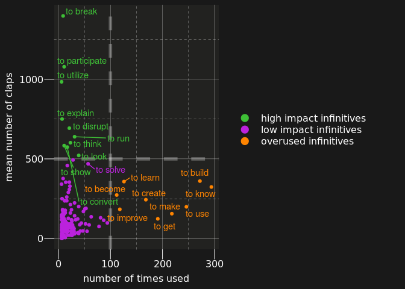
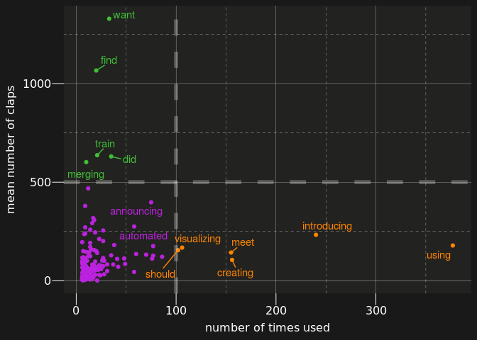
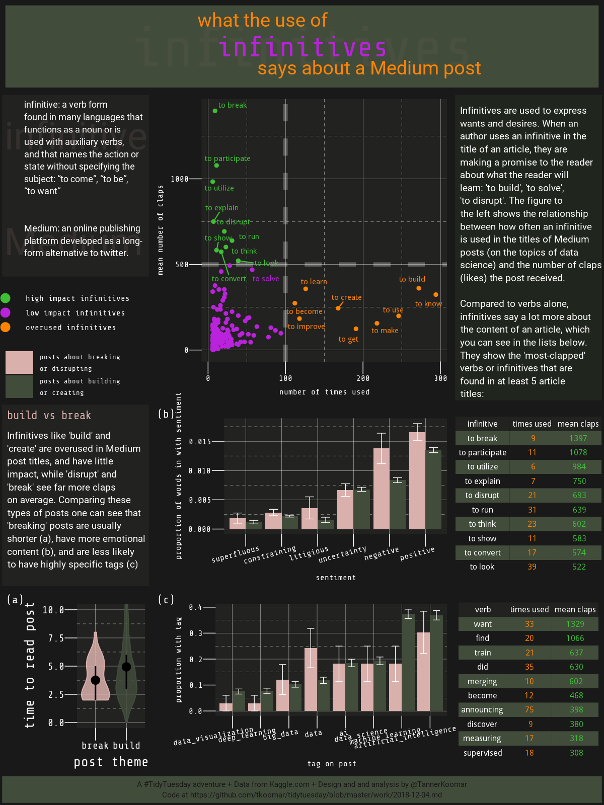

12-04-2018
================
Tanner Koomar
December 3, 2018

-   [Tidy the text](#tidy-the-text)
    -   [infinitives](#infinitives)
    -   [all verbs](#all-verbs)
-   [some plots](#some-plots)
    -   [scatter plots](#scatter-plots)
    -   [tables](#tables)
-   [break vs build](#break-vs-build)
    -   [topics / tags plot](#topics-tags-plot)
    -   [time to (ha)rvest some posts!](#time-to-harvest-some-posts)
    -   [sentiment plot](#sentiment-plot)
    -   [violin plot](#violin-plot)
    -   [legend](#legend)
-   [text boxes](#text-boxes)
    -   [header](#header)
    -   [definition sidebar](#definition-sidebar)
    -   [top sidebar](#top-sidebar)
    -   [bottom sidebar](#bottom-sidebar)
    -   [footer](#footer)
-   [stitch it together](#stitch-it-together)
-   [The final Plot](#the-final-plot)

Tidy the text
-------------

following along with this: <https://cran.r-project.org/web/packages/tidytext/vignettes/tidytext.html>

#### infinitives

``` r
dat_infin <- dat %>% unnest_tokens(infin, title, token = "ngrams", n = 2) %>%
  filter(str_detect(pattern = "to ", string = infin)) %>%
  mutate(word = str_remove(infin, "to ")) %>% 
  left_join(parts_of_speech) %>%
  mutate(word_stem = wordStem(word, "english")) %>%
  filter(str_detect(pos, regex("Verb", ignore_case = F)), 
         !duplicated(x1)) %>% 
  group_by(word_stem) %>%
  mutate(n = n()) %>%
  group_by(word_stem, n) %>%
  summarize(mean_claps = mean(claps),
            sum_claps = sum(claps), 
            infin = first(infin)
            )
```

    ## Joining, by = "word"

#### all verbs

``` r
dat_verb <- dat %>% unnest_tokens(word, title) %>%
  left_join(parts_of_speech) %>%
  filter(str_detect(pos, regex("Verb", ignore_case = F)), 
         !duplicated(x1)) %>% 
  mutate(word_stem = wordStem(word, "english")) %>%
  group_by(word_stem) %>%
  mutate(n = n()) %>%
  group_by(word_stem, n) %>%
  summarize(mean_claps = mean(claps),
            sum_claps = sum(claps),
            word = first(word)
            )
```

    ## Joining, by = "word"

some plots
----------

#### scatter plots

``` r
plot_point_infin <- dat_infin %>%
  filter(n > 5) %>%
  ggplot(aes(x = n, y = mean_claps, 
             color = case_when(
               mean_claps > 500 ~ "high impact infinitives", 
               n > 100 ~ "overused infinitives",
               TRUE ~ "low impact infinitives"
             ), 
             label = case_when(
               mean_claps > 500 | n > 100 ~ infin, 
               mean_claps > 200 & n > 50 ~ infin,
               TRUE ~ "")
             )
         ) + 
  scale_colour_manual(values = c(colors_merb[3], colors_merb[1], colors_merb[2]), 
                     guide = guide_legend(title = NULL, override.aes = list(size = 4)) )+ 
  geom_point() + 
  geom_vline(xintercept = 100,
             lwd = 2, 
             lty = 2,
             alpha = 0.3,
             color = "grey90") + 
  geom_hline(yintercept = 500, 
             lwd = 2,
             lty = 2, 
             alpha = 0.3,
             color = "grey90") + 
  geom_text_repel(force = 15,
                  show.legend = FALSE) + 
  theme_merb() +
  xlab("number of times used") +
  ylab("mean number of claps") + 

  theme(
    legend.text = element_text(size = 12),
    legend.box.just = "right"
    )

plot_point_infin 
```



``` r
dat_verb %>%
  filter(n > 5) %>%
  ggplot(aes(x = n, y = mean_claps, 
             color = case_when(
               mean_claps > 500 ~ "high_impact", 
               n > 100 ~ "overused",
               TRUE ~ "misc"
             ), 
             label = case_when(
    mean_claps > 500 | n > 100 ~ word, 
    mean_claps > 200 &  n > 50 ~ word, 
    TRUE ~ ""))) + 
  scale_colour_manual(values = c(colors_merb[3], colors_merb[1], colors_merb[2])) + 
  geom_point() + 
  geom_vline(xintercept = 100,
             lwd = 2, 
             lty = 2,
             alpha = 0.3,
             color = "grey90") + 
  geom_hline(yintercept = 500, 
             lwd = 2,
             lty = 2, 
             alpha = 0.3,
             color = "grey90") + 
  geom_text_repel(force = 15) + 
  theme_merb() +
  xlab("number of times used") +
  ylab("mean number of claps") + 
  theme(
    legend.position = "none"
    )
```



#### tables

``` r
gtable_theme <- ttheme_minimal(
               core = list(fontfamily = "Share Tech Mono",
                           bg_params = list(fill = c("#414C3B", "#191919")),
                           fg_params = list(
                             col = matrix(c("white", colors_merb[2], colors_merb[3]), 
                                          nrow = 10,
                                          ncol = 3, 
                                          byrow = T),
                             fontsize = 12
                                            )
                           ),
               colhead = list(
                 bg_params = list(fill = "#222220"),
                 fg_params = list(col = "white", 
                                  fontsize = 12)
               ),
               rowhead = list(),
               default = list(),
            padding =  unit(c(2, 3), "mm") 
             )

infin_list <- dat_infin %>% 
  ungroup() %>% 
  filter(n > 5) %>% 
  arrange(desc(mean_claps)) %>%
  select(infin, n, mean_claps) %>%
  mutate(mean_claps = round(mean_claps)) %>%
  rename("infinitive" = "infin", 
         "times used" = "n", 
         "mean claps" = "mean_claps") %>%
  head(10) %>%
  tableGrob(rows = NULL, 
             theme = gtable_theme
            )

verb_list <- dat_verb %>% 
  ungroup() %>% 
  filter(n > 5) %>% 
  arrange(desc(mean_claps)) %>%
  select(word, n, mean_claps) %>%
  mutate(mean_claps = round(mean_claps)) %>%
  rename("verb" = "word", 
         "times used" = "n", 
         "mean claps" = "mean_claps") %>%
  head(10) %>%
  tableGrob(rows = NULL,
             theme = gtable_theme)

plot(infin_list)
```


``` r
plot(verb_list)
```


break vs build
--------------

``` r
dat_bb <- dat %>% unnest_tokens(infin, title, token = "ngrams", n = 2, drop = FALSE) %>%
  filter(str_detect(pattern = "to ", string = infin)) %>%
  filter(infin %in% c("to break", "to disrupt", "to destroy", "to create", "to make", "to build")) %>%
  mutate(
    type = case_when(
      infin %in% c("to break", "to disrupt", "to destroy") ~ "break",
      TRUE ~ "build"
    )
  )
```

#### topics / tags plot

``` r
plot_topic <- dat_bb %>% 
  gather(tag, tag_true, contains("tag_")) %>%
  mutate(tag = str_remove(tag, "tag_")) %>%
  group_by(type, tag) %>%
  summarize(
    tag_prop = mean(tag_true),
    tag_sd = sd(tag_true),
    tag_se = tag_sd/sqrt(n())
    ) %>%
  ggplot(aes(
    x = factor(tag) %>% reorder(tag_prop, FUN = mean), 
    y = tag_prop, 
    fill = type)
    ) + 
  geom_col(position="dodge", stat="identity") + 
  scale_fill_manual(values = c(pink, olive), 
                    labels = c("posts about breaking\nor disrupting", "posts about building\nor creating"),
                    guide = guide_legend(title = NULL)) + 
  geom_errorbar(aes(ymin = tag_prop - tag_se, ymax = tag_prop + tag_se),
                position = position_dodge(0.9), 
                size = 0.3, 
                width = 0.5,
                color = "white"
                ) + 
  xlab("tag on post")+ 
  ylab("proportion with tag") + 
  theme_merb() + 
  theme(
    axis.text.x = element_text(hjust = .75, angle = 10)
  )
```

    ## Warning: Ignoring unknown parameters: stat

``` r
plot_topic
```


#### time to (ha)rvest some posts!

``` r
read_post <- function(url){
  tryCatch(
  read_html(url, options = "NOERROR") %>% 
  html_nodes(".graf--p") %>%
  html_text() %>%
  str_flatten(" "), 
  error = function(e){NA}, 
  warning  = function(w){NA}
  )
}

dat_bb <- dat_bb %>%
  mutate(
full_text = map(url, read_post)
)

dat_bb <- unnest(dat_bb)

## don't want to have to repeat that later, so save it now
save(dat_bb, file = "2018-12-04_scraped_posts.RData")
```

#### sentiment plot

Not sure if stemming is needed here, given the way the sentiment dictionaries are constructed . . .

``` r
sent <- get_sentiments("loughran") 

dat_sent <- dat_bb %>%  
  filter(!is.na(full_text)) %>%
  unnest_tokens(word, full_text) %>%
  left_join(sent)
```

    ## Joining, by = "word"

``` r
plot_sent <- dat_sent %>%
  group_by(x1, sentiment, type) %>%
  tally() %>%
  group_by(x1) %>% 
  mutate(
    proportion = n / sum(n)
  ) %>%
  filter(!is.na(sentiment)) %>%
  group_by(type, sentiment) %>%
  summarise(
    median_prop = median(proportion),
    sd = sd(proportion), 
    se = (1.2533 * sd) / sqrt(n())) %>%
  ggplot(aes(x = factor(sentiment) %>% reorder(median_prop), 
             y = median_prop, 
             fill = type)) + 
    geom_col(position = "dodge") + 
    scale_fill_manual(values = c(pink, olive)) + 
    geom_errorbar(aes(ymin = median_prop - se, ymax = median_prop + se),
                position = position_dodge(0.9), 
                size = 0.3, 
                width = 0.5,
                color = "white"
                ) + 
  xlab("sentiment")+ 
  ylab("proportion of words in with sentiment") + 
  theme_merb() + 
  theme(axis.text.x = element_text(angle = 15, hjust = .75))

plot_sent
```


#### violin plot

``` r
plot_violin <- dat_bb %>% 
  ggplot(aes(x = type, y= reading_time, fill = type, color = type)) + 
  geom_violin(alpha = 0.85) + 
  coord_cartesian(ylim = c(0,10)) +
  #geom_jitter(alpha = 0.3) + ## too busy
  stat_summary(fun.y = mean, 
               fun.ymin = function(x){ quantile(x, probs = 0.25) }, 
               fun.ymax = function(x){ quantile(x, probs = 0.75) }, 
               size = 0.75, color = "black"
                 ) +
  xlab("theme of post") + 
  ylab("time to read post") + 
  scale_fill_manual(values = c(pink, olive)) + 
  scale_color_manual(values = c(pink, olive)) + 
  theme_merb()  + 
  theme(#legend.position = "none", 
        axis.text = element_text(size = 15), 
        axis.title = element_text(size = 20))

plot_violin
```


#### legend

``` r
plot_leg <- grid.arrange(cowplot::get_legend(plot_topic), 
             cowplot::get_legend(plot_point_infin), 
             widths = c(15, 85),
             layout_matrix = rbind(c(3, 2),
                                   c(3, 1))
             )
```


text boxes
----------

#### header

``` r
header <- ggplot() + 
 annotate(geom = "text", 
          y = 3.25, 
          x = 1, 
          size = 10, 
          hjust = .8,
          family = "Roboto", 
          color = colors_merb_seq[2],
          label = "what the use of" 
          ) + 
 annotate(geom = "text", 
          y = 2, 
          x= 1, 
          size = 30, 
          family = "Share Tech Mono", 
          color = pink,
          alpha = 0.05,
          hjust = 0.5,
          label="infinitives"
          ) + 
   annotate(geom = "text", 
          y = 2, 
          x= 1, 
          size = 15, 
          family = "Share Tech Mono", 
          color = colors_merb_seq[5],
          hjust = 0.5,
          label="infinitives"
          ) + 
annotate(geom = "text", 
         y = 1, 
         x = 1, 
         size = 10,
         family = "Roboto", 
         color = colors_merb_seq[2], 
         hjust = .2,
         label = "says about a Medium post"
         ) + 
  ylim(0,4) + 
  theme_void() + 
  theme(
    plot.background = element_rect(color = "#191919",
                                   fill = olive, 
                                   size = 5)
  )

header
```


#### definition sidebar

``` r
def_sidebar <- ggplot()  +
  ylim(-2,2) + 
  xlim(-2,2) + 
       annotate("text", 
            x = -2, 
            y = 1.5, 
            hjust = 0, 
            vjust = 1, 
            lineheight = 0.75, 
            family = "Roboto", 
            size = 20,
            alpha = 0.1,
            color = "#D9B0AC",
           label = "infinitive") +
         annotate("text", 
            x = -2, 
            y = -1, 
            hjust = 0, 
            vjust = 1, 
            lineheight = 0.75, 
            family = "Roboto", 
            size = 20,
            alpha = 0.1,
            color = "#D9B0AC",
           label = "Medium") +
   annotate("text", 
            x = -1.5, 
            y = 2, 
            hjust = 0, 
            vjust = 1, 
            lineheight = 0.75, 
            family = "Roboto", 
            size = 4.8, 
            color = "white",
           label = paste0(
              str_wrap("infinitive: a verb form found in many languages that functions as a noun or is used with auxiliary verbs, and that names the action or state without specifying the subject: “to come”, “to be”, “to want”", 29), 
             "\n", "\n", "\n",
            str_wrap("Medium: an online publishing platform developed as a long-form alternative to twitter.", 29))
           ) +
  theme_void() + 
  theme(
    plot.background = element_rect(fill = "#222220" , color = "#191919", size = 2)
  )

def_sidebar
```


#### top sidebar

``` r
top_sidebar <- ggplot()  +
  ylim(-2,2) + 
  xlim(-2,2) +    
  annotate("text", 
            x = -2, 
            y = 2, 
            hjust = 0, 
            vjust = 1, 
            lineheight = 0.75, 
            family = "Roboto", 
            size = 5, 
            color = "white",
           label = paste0(
              str_wrap("Infinitives are used to express wants and desires. When an author uses an infinitive in the title of an article, they are making a promise to the reader about what the reader will learn: 'to build', 'to solve', 'to disrupt'. The figure to the left shows the relationship between how often an infinitive is used in the titles of Medium posts (on the topics of data science) and the number of claps (likes) the post received.", 32),
              "\n","\n",
              str_wrap("Compared to verbs alone, infinitives say a lot more about the content of an article, which you can see in the lists below. They show the 'most-clapped' verbs or infinitives that are found in at least 5 article titles:", 32)
           )
  )+
  theme_void() + 
  theme(
    plot.background = element_rect(fill = "#20261d" , color = "#191919", size = 2)
  )
top_sidebar 
```


#### bottom sidebar

``` r
bot_sidebar <- ggplot()  +
  ylim(-2,2) + 
  xlim(-2,2) +    
    annotate("text", 
            x = -2, 
            y = 2, 
            hjust = 0, 
            vjust = 1, 
            lineheight = 0.75, 
            family = "Share Tech Mono", 
            size = 6, 
            color = "#D9B0AC",
           label = "build vs break"
  ) +
  annotate("text", 
            x = -2, 
            y = 1.5, 
            hjust = 0, 
            vjust = 1, 
            lineheight = 0.75, 
            family = "Roboto", 
            size = 5, 
            color = "white",
           label = paste0(
             str_wrap("Infinitives like 'build' and 'create' are overused in Medium post titles, and have little impact, while 'disrupt' and 'break' see far more claps on average. Comparing these types of posts one can see that 'breaking' posts are usually shorter (a), have more emotional content (b), and are less likely to have highly specific tags (c)", 32)
           )
  ) +
  theme_void() + 
  theme(
    plot.background = element_rect(fill = "#222220" , color = "#191919", size = 2)
  )
bot_sidebar
```


#### footer

``` r
footer <-  ggplot()  +
  ylim(-2,2) + 
  xlim(-2,2) +    
  annotate("text", 
            x = 0, 
            y = 0, 
            hjust = .5, 
            vjust = .5, 
            lineheight = 0.75, 
            family = "Roboto", 
            size = 4, 
            color = "#191919",
           label = paste0(
             "A #TidyTuesday adventure + Data from Kaggle.com + Design and and analysis by @TannerKoomar", 
             "\n",  
             "Code at https://github.com/tkoomar/tidytuesday/blob/master/work/2018-12-04.md"
             )
             ) +
  theme_void() + 
  theme(
    plot.background = element_rect(fill = olive , color = "#191919", size = 2)
  )

  
footer
```


stitch it together
------------------

``` r
png("2018-12-04_final_plot.png", width = 1200, height = 1600, res = 144, bg = "#191919")

grid.arrange(header, 
             def_sidebar,
             plot_point_infin + theme(legend.position = 'none'),
             top_sidebar,
             plot_leg,
             infin_list,
             verb_list,
             plot_violin + theme(legend.position = 'none') + labs(tag = "a"),
             plot_sent + theme(legend.position = 'none'),
             plot_topic + theme(legend.position = 'none'),
             bot_sidebar,
             footer,
             heights = c(15, 30, 20, 30, 30, 5),
             layout_matrix = rbind(c(1,1,1,1),
                                   c(2,3,3,4),
                                   c(5,3,3,4),
                                   c(11,9,9,6),
                                   c(8,10,10,7),
                                   c(12,12,12,12))
               )

dev.off()
```

    ## png 
    ##   2

The final Plot
--------------


