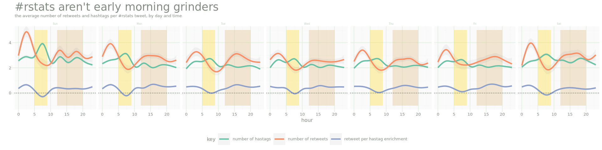
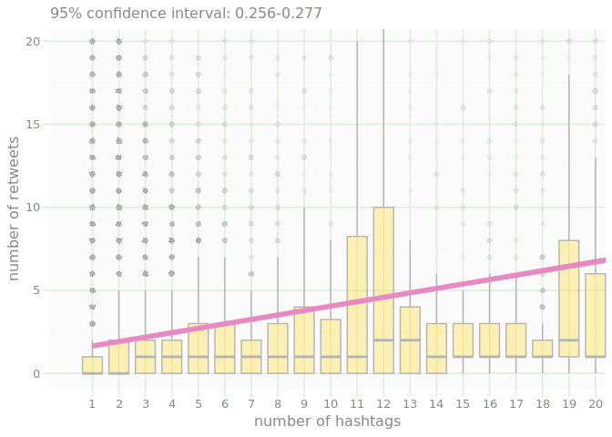
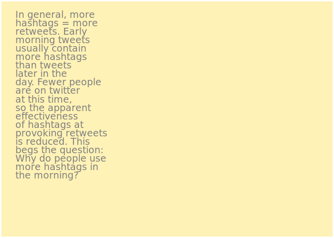
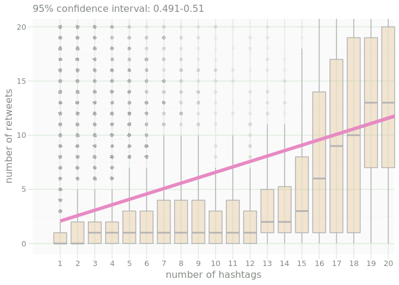
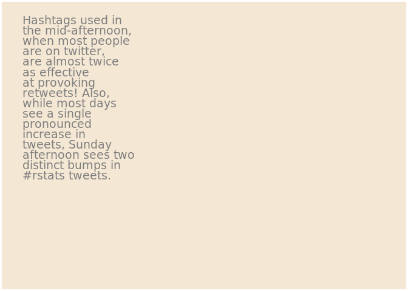
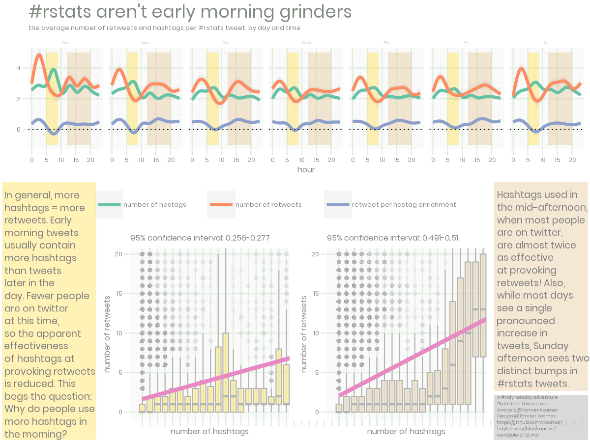

Rstats and Tidy Tuesday Tweets
================
Tanner Koomar
January 1, 2018

-   [make some new columns](#make-some-new-columns)
-   [Set lables of variables of interest](#set-lables-of-variables-of-interest)
-   [Main plot](#main-plot)
-   [Morning](#morning)
-   [afternoon](#afternoon)
    -   [sidebar](#sidebar)
    -   [footer](#footer)
-   [The final Plot](#the-final-plot)

``` r
library(tidyverse)
```

    ## ── Attaching packages ────────────────────────────────── tidyverse 1.2.1 ──

    ## ✔ ggplot2 3.1.0     ✔ purrr   0.2.5
    ## ✔ tibble  1.4.2     ✔ dplyr   0.7.7
    ## ✔ tidyr   0.8.2     ✔ stringr 1.3.1
    ## ✔ readr   1.1.1     ✔ forcats 0.3.0

    ## ── Conflicts ───────────────────────────────────── tidyverse_conflicts() ──
    ## ✖ dplyr::filter() masks stats::filter()
    ## ✖ dplyr::lag()    masks stats::lag()

``` r
library(lubridate)
```

    ## 
    ## Attaching package: 'lubridate'

    ## The following object is masked from 'package:base':
    ## 
    ##     date

``` r
library(gridExtra)
```

    ## 
    ## Attaching package: 'gridExtra'

    ## The following object is masked from 'package:dplyr':
    ## 
    ##     combine

``` r
source("https://raw.githubusercontent.com/tkoomar/ggplot2_themes/master/theme_cc.R")
```

    ## Loading required package: showtext

    ## Loading required package: sysfonts

    ## Loading required package: showtextdb

``` r
tidytuesday_tweets <- readRDS("../data/2019/2019-01-01/tidytuesday_tweets.rds")
rstats_tweets <- readRDS("../data/2019/2019-01-01/rstats_tweets.rds")


## helper function for formatting correlation output
slope_conf <- function(x, y){
  res <- lm(y ~ x)
  conf <- confint(res, "x", 0.95)
  paste0("95% confidence interval: ", round(conf[1], 3), "-", round(conf[2], 3))
}
```

make some new columns
---------------------

We want to get the day of the week, and claculate the number of hastags per tweet.

``` r
rstats_tweets <-rstats_tweets %>% 
  mutate(w_day = wday(created_at, label = TRUE),
         hour = hour(created_at)) %>%
  rowwise() %>%
  mutate(n_hash = length(hashtags))
```

Set lables of variables of interest
-----------------------------------

``` r
dat <- rstats_tweets %>%
  mutate("retweet per hastag enrichment" = log2(retweet_count/n_hash), 
         "number of hastags" = n_hash, 
         "number of retweets" = retweet_count ) %>%
  gather(key, value, "retweet per hastag enrichment", "number of hastags", "number of retweets")
```

Main plot
---------

``` r
morning_col <- alpha("#ffd92f", 0.35)
noon_col <- alpha("#e5c494", 0.4)

p_week <-  dat %>% ggplot(aes(x = hour, y = value, color = key)) + 
  annotate('rect', size = 0,
           xmin = 5, xmax = 9, 
           ymin = -1, ymax = 5, 
            fill = morning_col) + 
  annotate('rect', size = 0,
           xmin = 12, xmax = 20, 
           ymin = -1, ymax = 5, 
            fill = noon_col) + 
  stat_smooth(alpha = 0.1, size = 1.5) + 
  geom_hline(yintercept = 0, lty = 3) + 
  scale_color_brewer(palette = "Set2") + 
  facet_wrap(~ w_day, nrow = 1) + 
  coord_cartesian(ylim = c(-1,5)) + 
  ylab("") + 
  theme_cc(base_size = 12) +
  theme(legend.position = "bottom", 
        plot.title = element_text(size = 26)) + 
  ggtitle("#rstats aren't early morning grinders", "the average number of retweets and hashtags per #rstats tweet, by day and time")
p_week
```

    ## `geom_smooth()` using method = 'gam' and formula 'y ~ s(x, bs = "cs")'

    ## Warning: Removed 243274 rows containing non-finite values (stat_smooth).



Morning
-------

``` r
p_morning <- dat %>% 
  filter(hour >= 5 & hour <= 9 ) %>% 
  filter(retweet_count < 500) %>%    ## there are a couple big outliers here
  {
    ggplot(., aes(x = as.factor(n_hash), y = retweet_count)) + 
      #geom_jitter(color = alpha(noon_col, 0.05)) + 
      geom_boxplot(color = "#b3b3b3", fill = morning_col, outlier.colour = alpha("#b3b3b3", 0.02)) + 
      stat_smooth(method = "lm", color = "#e78ac3", size = 2, 
                  aes(x = (n_hash), y = retweet_count)) + 
      coord_cartesian(xlim = c(0, 19.75 ), ylim = c(0, 19.75)) + 
      ggtitle(slope_conf(.$n_hash, .$retweet_count)) + 
      theme_cc(base_size = 12) + 
      xlab("number of hashtags") + 
      ylab("number of retweets")
  }
p_morning
```

 \#\#\# sidebar

``` r
morning_sidebar <- ggplot()  +
  ylim(-2,2) + 
  xlim(-2,2) +    
  annotate("text", 
            x = -2, 
            y = 2, 
            hjust = 0, 
            vjust = 1, 
            lineheight = 0.75, 
            family = "Poppins", 
            size = 5, 
            color = "grey50",
           label = str_wrap(string = "In general, more hashtags = more retweets. Early morning tweets usually contain more hashtags than tweets later in the day. Fewer people are on twitter at this time, so the apparent effectiveness of hashtags at provoking retweets is reduced. This begs the question: Why do people use more hashtags in the morning?", 
                            width = 18)
  ) +
  theme_void() + 
  theme(
    plot.background = element_rect(
      fill = morning_col,color = "white", size = 2
      )
  )

morning_sidebar
```



afternoon
---------

``` r
p_noon <- dat %>% 
  filter(hour >= 12 & hour <= 20 ) %>% 
  filter(retweet_count < 500) %>%    ## there are a couple big outliers here
  {
    ggplot(., aes(x = as.factor(n_hash), y = retweet_count)) + 
      #geom_jitter(color = alpha(noon_col, 0.05)) + 
      geom_boxplot(color = "#b3b3b3", fill = noon_col, outlier.colour = alpha("#b3b3b3", 0.02)) + 
      stat_smooth(method = "lm", color = "#e78ac3", size = 2, 
                  aes(x = (n_hash), y = retweet_count)) + 
      coord_cartesian(xlim = c(0, 19.75 ), ylim = c(0, 19.75)) + 
      ggtitle(slope_conf(.$n_hash, .$retweet_count)) + 
      theme_cc(base_size = 12) + 
      xlab("number of hashtags") + 
      ylab("number of retweets")
  }

p_noon
```



### sidebar

``` r
noon_sidebar <- ggplot()  +
  ylim(-2,2) + 
  xlim(-2,2) +    
  annotate("text", 
            x = -2, 
            y = 2, 
            hjust = 0, 
            vjust = 1, 
            lineheight = 0.75, 
            family = "Poppins", 
            size = 5,
            color = "grey50",
           label = str_wrap(string = "Hashtags used in the mid-afternoon, when most people are on twitter, are almost twice as effective at provoking retweets! Also, while most days see a single pronounced increase in tweets, Sunday afternoon sees two distinct bumps in #rstats tweets.", 
                            width = 18)
  ) +
  theme_void() + 
  theme(
    plot.background = element_rect(
      fill = noon_col, color = "white", size = 2
      ), 
    plot.margin = unit(c(.01,.01,.01,.01), 'npc')
  )

noon_sidebar
```



### footer

``` r
footer <- ggplot()  +
  ylim(-2,2) + 
  xlim(-2,2) +    
  annotate("text", 
            x = -2, 
            y = 2, 
            hjust = 0, 
            vjust = 1, 
            lineheight = 0.75, 
            family = "Poppins", 
            size = 2.5, 
            color = "grey50",
           label = paste0("A #TidyTuesday adventure\n",
             "Data from rtweet.info\n",
             "Analysis @Tanner Koomar\n",
             "Design @Tanner Koomar\n",
             "https://github.com/tkoomar/\ntidytuesday/blob/master/\nwork/2019-01-01.md")
  ) +
  theme_void() + 
  theme(
    plot.background = element_rect(
      fill = alpha("#b3b3b3", 0.5), color = "white", size = 2
      ), 
    plot.margin = unit(c(.01,.01,.01,.01), 'npc')
  )

footer
```


Assemble! \#\#\#\# legend

``` r
plot_leg <-  cowplot::get_legend(p_week +
                        theme(legend.title = element_blank(), 
                              legend.justification = 'right'))
plot_leg
```

    ## TableGrob (5 x 5) "guide-box": 2 grobs
    ##                                     z     cells                  name
    ## 99_e27293391d92b7a74a1c708851c8c43e 1 (3-3,3-3)                guides
    ##                                     0 (2-4,2-4) legend.box.background
    ##                                               grob
    ## 99_e27293391d92b7a74a1c708851c8c43e gtable[layout]
    ##                                     zeroGrob[NULL]

``` r
png("2019-01-01_final_plot.png", width = 1200, height = 900, res = 144, bg = "white")

grid.arrange(
  p_week + theme(legend.position = 'none'), 
  morning_sidebar, 
  p_morning + theme(axis.text.x = element_blank()), 
  p_noon + theme(axis.text.x = element_blank()), 
  noon_sidebar, 
  footer, 
  plot_leg,
  heights = c(.55,.15, .25,.25,.15),
  widths = c(.5, 1, 1, .5),
  layout_matrix = rbind(c(1,1,1,1),
                        c(2,7,7,5),
                        c(2,3,4,5),
                        c(2,3,4,5),
                        c(2,3,4,6)
    
  )
)
```

    ## `geom_smooth()` using method = 'gam' and formula 'y ~ s(x, bs = "cs")'

    ## Warning: Removed 243274 rows containing non-finite values (stat_smooth).

``` r
dev.off()
```

    ## png 
    ##   2

The final Plot
--------------


