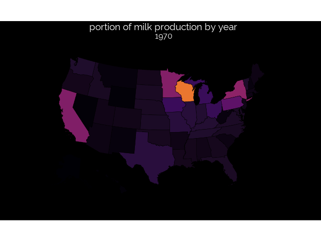

```{r}
library(tidyverse)
require(transformr)
library(urbnmapr)
library(gridExtra)
library(gganimate)
library(patchwork)

source('https://raw.githubusercontent.com/tkoomar/ggplot2_themes/master/theme_black.R')

milk_state <- read_csv("../data/2019/2019-01-29/state_milk_production.csv")

milk_state <- milk_state %>% 
  rename('state_name' = 'state') 
  

data('states')

milk_map <- left_join(milk_state, states)
```

## MAKE A MAP

```{r}
map_plot <- milk_map %>% 
  group_by(year) %>%
  mutate(milk_total = sum(milk_produced),
    milk_scaled = milk_produced/milk_total
    ) %>%
  ggplot(aes(x = long, y = lat, fill = milk_scaled, group = group)) + 
  geom_polygon(size = 0.25, color = 'black') + 
  coord_map(projection = "albers", lat0 = 39, lat1 = 45) +
  scale_fill_viridis_c(option = "inferno")+
  #scale_fill_distiller(palette = 'PuBuGn', direction = 1) + 
  theme_black() + 
  theme(legend.position = 'none', 
        axis.text = element_blank(), 
        axis.ticks = element_blank(), 
        axis.line = element_blank(), 
        axis.title = element_blank(), 
        panel.grid = element_blank()) + 
  ggtitle("portion of milk production by year", "{closest_state}")
```

#### Animate map

```{r}
map_anim <- map_plot + transition_states(states = year, 
                                         transition_length = 5, 
                                         state_length = 5, 
                                         wrap = TRUE)

anim_save(animation = map_anim, 
          filename = "2019-01-29_final_plot.gif", 
          width = 640
          )
```


## The final Plot
