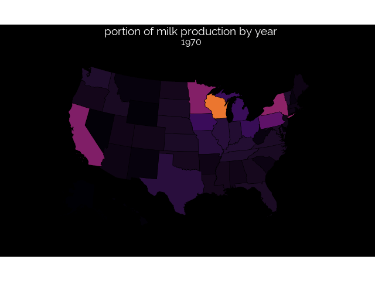

Milk Map
================
Tanner Koomar
January 29, 2018

-   [MAKE A MAP](#make-a-map)
    -   [Animate map](#animate-map)
-   [The final Plot](#the-final-plot)

``` r
library(tidyverse)
```

    ## ── Attaching packages ───────────────────

    ## ✔ ggplot2 3.1.0     ✔ purrr   0.2.5
    ## ✔ tibble  1.4.2     ✔ dplyr   0.7.7
    ## ✔ tidyr   0.8.2     ✔ stringr 1.3.1
    ## ✔ readr   1.1.1     ✔ forcats 0.3.0

    ## ── Conflicts ─── tidyverse_conflicts() ──
    ## ✖ dplyr::filter() masks stats::filter()
    ## ✖ dplyr::lag()    masks stats::lag()

``` r
require(transformr)
```

    ## Loading required package: transformr

``` r
library(urbnmapr)
library(gridExtra)
```

    ## 
    ## Attaching package: 'gridExtra'

    ## The following object is masked from 'package:dplyr':
    ## 
    ##     combine

``` r
library(gganimate)
library(patchwork)

source('https://raw.githubusercontent.com/tkoomar/ggplot2_themes/master/theme_black.R')
```

    ## Loading required package: showtext

    ## Loading required package: sysfonts

    ## Loading required package: showtextdb

``` r
milk_state <- read_csv("../data/2019/2019-01-29/state_milk_production.csv")
```

    ## Parsed with column specification:
    ## cols(
    ##   region = col_character(),
    ##   state = col_character(),
    ##   year = col_integer(),
    ##   milk_produced = col_double()
    ## )

    ## Warning in rbind(names(probs), probs_f): number of columns of result is not
    ## a multiple of vector length (arg 1)

    ## Warning: 50 parsing failures.
    ## row # A tibble: 5 x 5 col     row col   expected           actual file                                expected   <int> <chr> <chr>              <chr>  <chr>                               actual 1  1501 year  no trailing chara… e3     '../data/2019/2019-01-29/state_mil… file 2  1502 year  no trailing chara… e3     '../data/2019/2019-01-29/state_mil… row 3  1503 year  no trailing chara… e3     '../data/2019/2019-01-29/state_mil… col 4  1504 year  no trailing chara… e3     '../data/2019/2019-01-29/state_mil… expected 5  1505 year  no trailing chara… e3     '../data/2019/2019-01-29/state_mil…
    ## ... ................. ... ........................................................................... ........ ........................................................................... ...... ........................................................................... .... ........................................................................... ... ........................................................................... ... ........................................................................... ........ ...........................................................................
    ## See problems(...) for more details.

``` r
milk_state <- milk_state %>% 
  rename('state_name' = 'state') 
  

data('states')

milk_map <- left_join(milk_state, states)
```

    ## Joining, by = "state_name"

MAKE A MAP
----------

``` r
map_plot <- milk_map %>% 
  group_by(year) %>%
  mutate(milk_total = sum(milk_produced),
    milk_scaled = milk_produced/milk_total
    ) %>%
  ggplot(aes(x = long, y = lat, fill = milk_scaled, group = group)) + 
  geom_polygon(size = 0.25, color = 'black') + 
  coord_map(projection = "albers", lat0 = 39, lat1 = 45) +
  scale_fill_viridis_c(option = "inferno")+
  #scale_fill_distiller(palette = 'PuBuGn', direction = 1) + 
  theme_black() + 
  theme(legend.position = 'none', 
        axis.text = element_blank(), 
        axis.ticks = element_blank(), 
        axis.line = element_blank(), 
        axis.title = element_blank(), 
        panel.grid = element_blank()) + 
  ggtitle("portion of milk production by year", "{closest_state}")
```

#### Animate map

``` r
map_anim <- map_plot + transition_states(states = year, 
                                         transition_length = 5, 
                                         state_length = 5, 
                                         wrap = TRUE)

anim_save(animation = map_anim, 
          filename = "2019-01-29_final_plot.gif", 
          width = 640
          )
```

    ## Warning in lapply(row_vars$states, as.integer): NAs introduced by coercion

    ## Warning in f(..., self = self): NAs introduced by coercion

The final Plot
--------------


