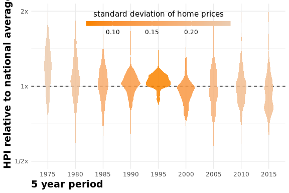
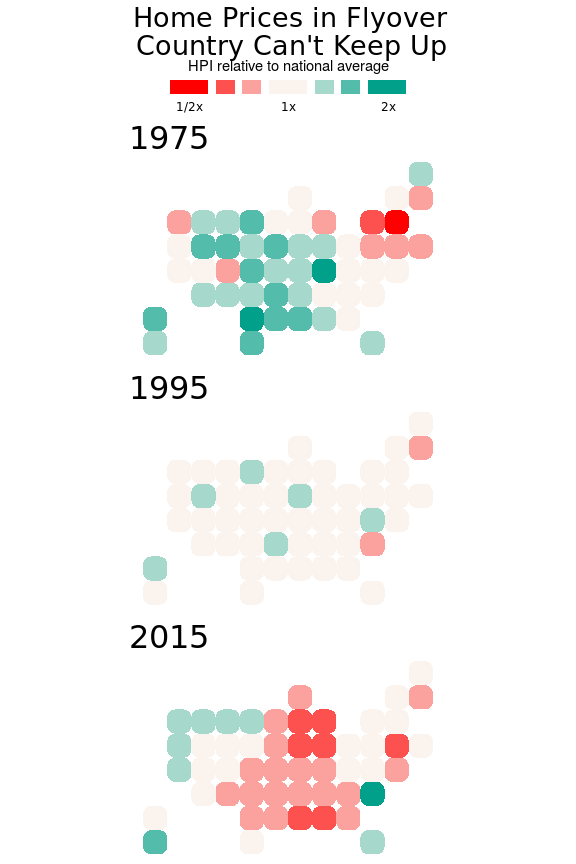
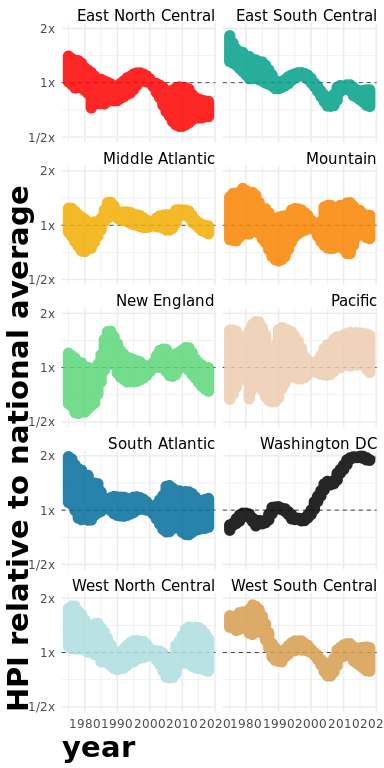
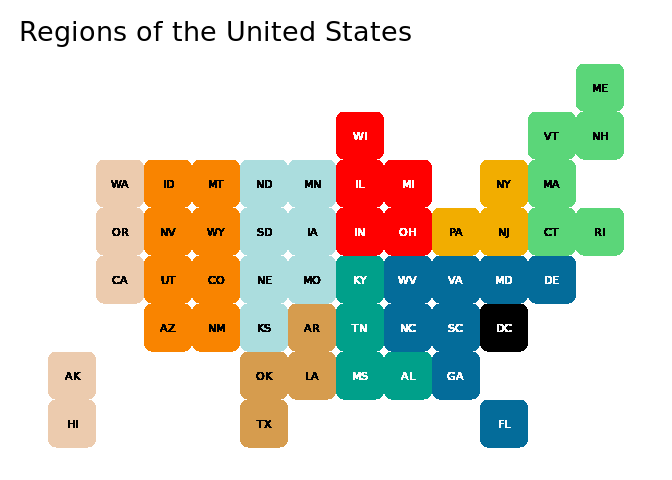
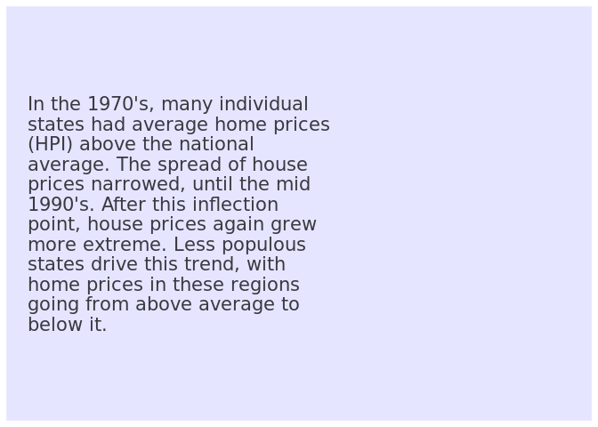
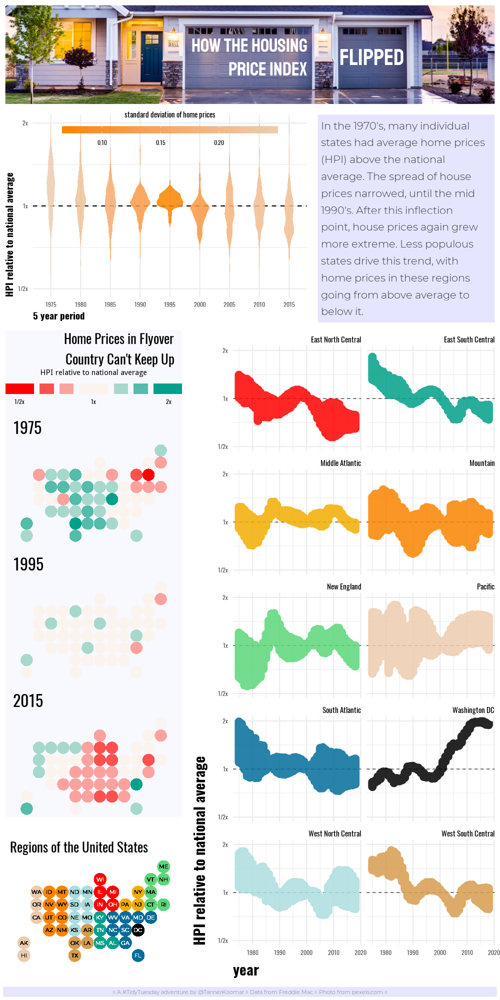

Housing Price Index
================
Tanner Koomar
February 5, 2018

-   [format data](#format-data)
-   [A new theme](#a-new-theme)
-   [violin plot](#violin-plot)
-   [statebin maps](#statebin-maps)
-   [line plots](#line-plots)
-   [map key](#map-key)
-   [texts](#texts)
    -   [title](#title)
    -   [narrative](#narrative)
    -   [footer](#footer)
-   [Asemble](#asemble)
-   [The final Plot](#the-final-plot)

``` r
library(tidyverse)
```

    ## ── Attaching packages ────────────────────── tidyverse 1.2.1 ──

    ## ✔ ggplot2 3.1.0     ✔ purrr   0.2.5
    ## ✔ tibble  1.4.2     ✔ dplyr   0.7.7
    ## ✔ tidyr   0.8.2     ✔ stringr 1.3.1
    ## ✔ readr   1.1.1     ✔ forcats 0.3.0

    ## ── Conflicts ───────────────────────── tidyverse_conflicts() ──
    ## ✖ dplyr::filter() masks stats::filter()
    ## ✖ dplyr::lag()    masks stats::lag()

``` r
library(statebins)
library(cowplot)
```

    ## 
    ## Attaching package: 'cowplot'

    ## The following object is masked from 'package:ggplot2':
    ## 
    ##     ggsave

``` r
library(magick)
```

    ## Linking to ImageMagick 6.8.9.9
    ## Enabled features: cairo, fontconfig, freetype, fftw, lcms, pango, rsvg, x11
    ## Disabled features: ghostscript, webp

``` r
library(showtext) ## for google fonts
```

    ## Loading required package: sysfonts

    ## Loading required package: showtextdb

``` r
font_add_google("Staatliches")
font_add_google("Oswald")
font_add_google("Montserrat", regular.wt = 300, bold.wt = 500)
showtext_auto()


## read in data
hpi_dat <- read_csv("../data/2019/2019-02-05/state_hpi.csv")
```

    ## Parsed with column specification:
    ## cols(
    ##   year = col_integer(),
    ##   month = col_integer(),
    ##   state = col_character(),
    ##   price_index = col_double(),
    ##   us_avg = col_double()
    ## )

format data
-----------

``` r
hpi_dat <- hpi_dat %>% 
  mutate(years =  cut(year, 
                       breaks = c(1975, 1980, 1985, 1990, 1995, 2000, 2005, 2010, 2015, 2018), 
                       labels = c(1975, 1980, 1985, 1990, 1995, 2000, 2005, 2010, 2015), 
                       include.lowest = TRUE
                       )
         ) %>%
  group_by(years) %>%
  mutate(
    price_ratio = price_index/us_avg,
    price_sd = sd(price_index/us_avg)
    ) %>% 
  ungroup() %>%
  left_join(tibble(state = state.abb, region = as.character(state.division))) %>%
  mutate(region = replace_na(region, "Washington DC"))
```

    ## Joining, by = "state"

A new theme
-----------

``` r
theme_house<- function(base_size = 11, base_family = "Oswald", base_line_size = base_size/22, base_rect_size = base_size/22) {
      theme_minimal(base_size = base_size, 
               base_family = base_family,
               base_line_size = base_line_size, 
               base_rect_size = base_rect_size) %+replace% 
    theme(axis.title = element_text(face = 'bold', hjust = 0, size = 14),
          strip.text = element_text(hjust = 1))
    }
```

violin plot
-----------

``` r
violin <- hpi_dat %>%
  ggplot(aes(x = years, y = (price_ratio), fill = price_sd)) + 
  geom_hline(yintercept = 1 , lty = 2) + 
  geom_violin(color = NA, alpha = 0.85) + 
  scale_fill_gradientn(colors = c("#F98400","#ECCBAE"), name = 'standard deviation of home prices') + 
  labs(x = "5 year period", 
       y = "HPI relative to national average"
       ) + 
  guides(fill = guide_colorbar(title.position = "top", 
                               title.hjust = 0.5, 
                               label.position = 'bottom', 
                               barwidth = 15, 
                               barheight = .5)
         ) + 
  scale_y_continuous(trans = 'log2', breaks = c(1/2, 1, 2), labels = c("1/2x", "1x", "2x"), limits = c(1/2,2)) + 
  #scale_fill_viridis_c(direction = -1, option = "E") + 
  theme_house() + 
  theme(legend.direction = 'horizontal', 
        legend.justification = c(.5, 0),
        legend.position = c(0.5, 0.78)
        )

violin
```

    ## Warning: Removed 1 rows containing non-finite values (stat_ydensity).



statebin maps
-------------

``` r
bin_maps <- hpi_dat %>%
  filter(years %in% c(1975, 1995, 2015)) %>%
  ggplot(aes(state = state, 
             fill = cut(log2(price_ratio), 
                        breaks = c(-Inf, -.625, -.375, -.125, .125, .375, .625, Inf), include.lowest = TRUE,
                        labels = c("-1", "-1/2", "-1/4", "0", "1/4", "1/2", "1")
                        )
             ) 
         ) + 
  geom_statebins(border_size = 0, dark_lbl = NA, light_lbl = NA) + 
  facet_wrap(~years, nrow = 3) + 
  coord_equal() + 
  guides(fill = guide_legend(title.position = 'top',
                             title.hjust = 0.5, 
                             label.position = 'bottom', 
                             direction = 'horizontal', 
                             nrow = 1, 
                             keyheight = .75, 
                             keywidth = c(2, 1, 1, 2, 1, 1, 2)
                             )
         ) + 
  scale_fill_manual(values = colorRampPalette(c("#FF0000", "#fbf4ee", "#00A08A"))(7),  
                    name = "HPI relative to national average", 
                    labels = c("1/2x", "", "", "1x", "", "", " 2x")) + 
  ggtitle("Home Prices in Flyover\nCountry Can't Keep Up") + 
  theme_void() + 
  theme(plot.title=element_text(family = "Oswald", 
                                size=20, 
                                hjust=1, 
                                lineheight = 0.85), 
        plot.margin = margin(0,10,0,10), 
        strip.text = element_text(family = "Oswald", 
                                  size = 24,
                                  hjust = 0),
        legend.position = 'top', 
        legend.justification = 0.5,
        legend.direction = 'horizontal', 
        legend.text = element_text(family = "Oswald")
       )

bin_maps
```



line plots
----------

``` r
lines <- hpi_dat %>%
  group_by(year, region) %>%
  ggplot(aes(x = year, y = price_ratio, color = region, group = region)) + 
  geom_hline(yintercept = 1, lty = 2, lwd = 0.25) + 
  scale_y_continuous(trans = 'log2', breaks = c(1/2, 1, 2), labels = c("1/2x", "1x", "2x"), limits = c(1/2,2)) + 
  labs(y = "HPI relative to national average") + 
  geom_line(alpha = 0.85, size = 4, show.legend = FALSE) + 
  facet_wrap(~region, ncol = 2) + 
  scale_color_manual(values = c("#FF0000", "#00A08A", "#F2AD00", "#F98400", "#5bd679", "#ECCBAE", "#046C9A", "#000000", "#ABDDDE", "#D69C4E" )) +
  theme_house() + 
  theme(axis.title = element_text(size = 22))
lines
```

    ## Warning: Removed 1 rows containing missing values (geom_path).



map key
-------

``` r
bin_map_key <- hpi_dat %>%
  left_join(tibble(state = state.abb, region = state.division)) %>%
  ggplot(aes(state = state, fill = region)) + 
  geom_statebins(border_size = 0, family = "Montserrat" ) + 
  scale_fill_manual(values = c("#FF0000", "#00A08A", "#F2AD00", "#F98400", "#5bd679", "#ECCBAE", "#046C9A", "#000000", "#ABDDDE", "#D69C4E")) + 
  coord_equal() + 
  ggtitle("Regions of the United States") + 
  theme_void() + 
  theme(plot.title=element_text(family = "Oswald", size=20, hjust=0), 
        plot.margin = margin(10,10,10,10), 
        legend.position = 'none'
        ) 
```

    ## Joining, by = c("state", "region")

    ## Warning: Column `region` joining character vector and factor, coercing into
    ## character vector

``` r
bin_map_key
```



texts
-----

#### title

``` r
header <- ggplot() + 
 annotate(geom = "text", 
          y = -0.1, 
          x = 0.5, 
          size = 10,
          family = "Staatliches",
          color = 'white',
          alpha = 1,
          lineheight = 0.7,
          hjust = 1,
          label="HOW THE HOUSING\nPRICE INDEX"
          ) + 
   annotate(geom = "text", 
          y = -0.1, 
          x = .79, 
          size = 12,
          family = "Staatliches", 
          color = 'white',
          alpha = 1,
          lineheight = 0.9,
          hjust = 0,
          label="FLIPPED" 
          ) + 
  ylim(-2,2) + 
  xlim(-2,2) + 
  theme_void() + 
  theme(
    plot.background = element_rect(color = "white",
                                   fill = "transparent", 
                                   size = 5)
  )


ggdraw() + draw_image("house.png") + draw_plot(header)
```


#### narrative

``` r
narr <- ggplot() + 
 annotate(geom = "text", 
          y = 0, 
          x= -2, 
          size = 5.5, 
          family = "Montserrat", 
          color = 'black',
          alpha = 0.75, 
          lineheight = 0.9,
          hjust = 0,
          label=str_wrap("In the 1970's, many individual states had average home prices (HPI) above the national average. The spread of house prices narrowed, until the mid 1990's. After this inflection point, house prices again grew more extreme. Less populous states drive this trend, with home prices in these regions going from above average to below it.", 30)
          ) + 
  ylim(-2,2) + 
  xlim(-2,2) + 
  theme_void() + 
  theme(
    plot.background = element_rect(color = "white",
                                   fill = '#e5e5ff', 
                                   size = 5)
  )

narr
```



### footer

``` r
foot <- ggplot() + 
 annotate(geom = "text", 
          y = 0, 
          x= 0, 
          size = 3, 
          family = "Montserrat", 
          color = 'black',
          alpha = 0.5,
          hjust = 0.5,
          label= "◊ A #TidyTuesday adventure by @TannerKoomar ◊ Data from Freddie Mac ◊ Photo from pexels.com ◊"
          ) + 
  ylim(-2,2) + 
  xlim(-2,2) + 
  theme_void() + 
  theme(
    plot.background = element_rect(color = "white",
                                   fill = '#e5e5ff', 
                                   size = 3)
  )

foot
```


Asemble
-------

let's try cowplot this time

``` r
final_plot <- plot_grid(
  (ggdraw() + draw_image("house.png") + draw_plot(header)), 
  plot_grid(violin, 
            narr, 
            rel_widths = c(5,3)
            ),
  plot_grid(
            plot_grid(bin_maps + theme(plot.background = element_rect(fill = alpha('#e5e5ff', 0.25), 
                                                                      color = 'white', 
                                                                      size = 2)
                                       ),
                      bin_map_key, 
                      ncol = 1,
                      rel_heights = c(3,1)
                      ), 
            lines, 
            rel_widths = c(3, 5)
            ),
  foot,
  ncol = 1, 
  rel_heights = c(1, 2, 6, 0.15)
)

png("2019-02-05_final_plot.png", width = 1000, height = 2000, res = 144, bg = "white")
final_plot
dev.off()
```

    ## png 
    ##   2

The final Plot
--------------


